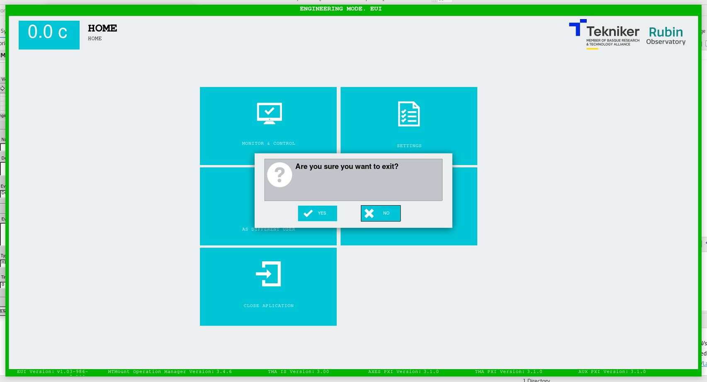

### CLOSING THE APPLICATION

After pressing the softkey "CLOSE APPLICATION", [see](../01_DescriptionOfScreens/01_Home_Screen_Home.md), the following
application closure confirmation message is displayed, see Figure 2‑106:

- YES: Closes the application.
- NO: Continues in the application.

*Figure 2‑106. Closing confirmation screen.*
